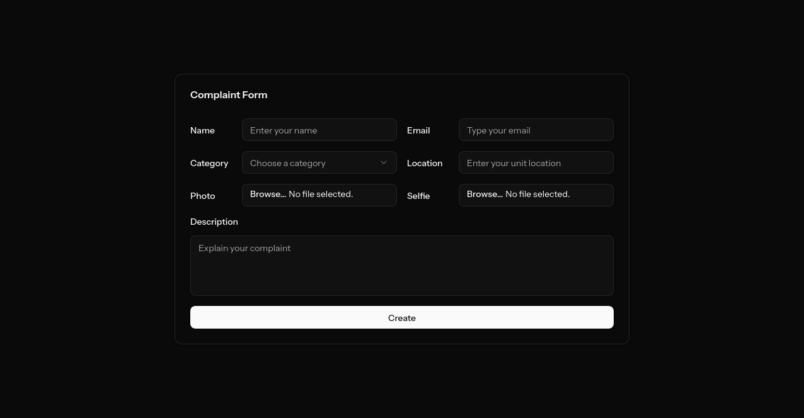

# Smart Complaint Management

Smart Complaint Management adalah aplikasi manajemen keluhan penghuni apartemen yang dikembangkan dalam rangka **Seleksi Hackathon Beasiswa Semesta batch ke-7 by Sevima**.  
Proyek ini bertujuan untuk mengotomatisasi proses pelaporan, penugasan, dan analisis keluhan secara real-time.

---

## 🚀 Hackathon Submission

### ✅ Implemented Features
- [x] **Complaint Form Page (Frontend)**
  - Input: `Name`, `Email`, `Category`, `Location`, `Photo`, `Selfie`, `Description`.
  - Dibangun dengan **React + Tailwind + Shadcn**.
- [x] **Basic Backend Setup (Laravel + PostgreSQL)**
  - Migrations untuk `complaints` table.
  - Model `Complaint`.

### 📸 Screenshot
_Complaint Form UI_
;

---

## 🛠️ Tech Stack
- **Backend**: Laravel
- **Frontend**: React + TailwindCSS + Shadcn
- **Database**: PostgreSQL

---

## ⚡ Installation & Setup

```bash
# 1. Clone repository
git clone https://github.com/riyandarmawan/Hackathon-Semesta7-Programmer-Riyan-Darmawan
cd Hackathon-Semesta7-Programmer-Riyan-Darmawan

# 2. Install dependencies
composer install
npm install  # atau pnpm install

# 3. Setup environment
cp .env.example .env
# lalu sesuaikan konfigurasi database

# 4. Jalankan development server
composer run dev
